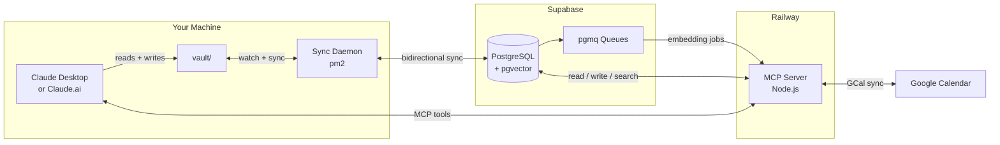

[](https://railway.com/new/template/TEMPLATE_CODE)

# MindStone

A self-hosted personal AI OS — your notes, calendar, and knowledge base, backed by your own infrastructure.

---

## What is MindStone?

MindStone is a self-hosted system that makes Claude AI aware of your personal knowledge base and calendar. Instead of starting every conversation from scratch, Claude has access to everything you've written — your notes, daily logs, saved articles, health journal, goals, and calendar events — through a set of MCP tools running on your own infrastructure.

The foundation is a local vault: a directory of plain markdown files on your machine. You write in it, Claude reads and writes to it, and a sync daemon keeps it bidirectionally synchronized with a Supabase database in real time. The markdown files are always the source of truth; the database is what makes semantic search and remote access possible.

With the vault connected, Claude can do things that would otherwise require a commercial productivity app: search across all your notes by meaning (not just keywords), extract and save content from YouTube videos, articles, and PDFs, read your Google Calendar and create events, and run structured health journaling sessions with full context from your past entries.

The self-hosted design is intentional. Your data never touches Anthropic's servers. You control the Supabase database, the Railway deployment, and the vault files themselves. When you want to understand what's stored, you open a markdown file. When you want to delete something, you delete it. There is no black box.

---

## How It Works

MindStone has four subsystems that work together:

**Sync Daemon** — A Node.js process managed by pm2 that runs on your local machine. It watches your `vault/` directory for file changes and syncs new or modified files to Supabase in real time. It also pulls down changes from Supabase — for example, event files created by the `manage_event` MCP tool will appear in your local vault within seconds of creation.

**Intelligence Pipeline** — When a file is saved to Supabase, the pipeline processes it asynchronously: extracting content from external URLs, generating tags with Gemini, creating vector embeddings with OpenAI, and storing them in Supabase's pgvector extension. This background processing is what makes `search_notes` work semantically — finding notes by meaning, not just exact keyword matches.

**MCP Server** — A Node.js server deployed to Railway that exposes 9 tools Claude can call: extract content from URLs, search and manage notes, read and create calendar events, and initialize health journaling sessions. The server bridges Claude to your Supabase database and Google Calendar API. It authenticates with OAuth2 so only you can connect to it.

**Personas & Skills** — Prompt files stored in `.personas/` and `.claude/skills/` that give Claude specialized roles and reusable workflows. The Doctor persona turns Claude into a health journaling companion that reviews your past entries and tracks trends. Skills like `/brief`, `/shutdown`, `/log`, and `/setup` give Claude structured workflows for daily rituals, end-of-day reviews, and vault orientation.



---

## Cost

MindStone uses four paid services. Estimated monthly cost for a single user:

| Service | Free Tier | Typical Monthly Cost |
|---------|-----------|---------------------|
| Railway | $5/mo credit on Hobby plan | ~$5–15/mo (MCP server) |
| Supabase | 500MB storage, 50k row reads | $0 on free tier; $25/mo on Pro |
| OpenAI | Pay per use | ~$1–3/mo (text-embedding-3-small) |
| Gemini | Pay per use | ~$1–5/mo (gemini-flash for tagging) |
| Supadata | Pay per use | ~$0–2/mo (YouTube transcripts) |
| **Total** | | **~$7–25/mo** |

Supabase free tier is sufficient for personal use. Railway Hobby plan covers most usage. AI costs depend on how frequently you extract and tag content.

---

## Prerequisites

> **Windows users:** All commands in this guide must be run from a [WSL (Windows Subsystem for Linux)](https://learn.microsoft.com/en-us/windows/wsl/install) terminal. There is no separate PowerShell script — WSL provides the bash environment required by `setup.sh` and `install.sh`.

- Node.js 20+ (for the local daemon and build step)
- npm (comes with Node.js)
- pm2 (`npm install pm2@latest -g` — or `install.sh` handles this)
- Supabase account (free tier works) — [supabase.com](https://supabase.com)
- Railway account — [railway.com](https://railway.com)
- OpenAI API key — [platform.openai.com/api-keys](https://platform.openai.com/api-keys)
- Gemini API key — [aistudio.google.com/apikey](https://aistudio.google.com/apikey)
- Supadata API key (optional — for YouTube) — [supadata.ai](https://supadata.ai)

> **Security note:** Never commit `.env` files or `credentials.json` to git. These are excluded by `.gitignore` but be careful when sharing forks or branches.

---

## Setup

Setup takes 7 steps. Read each step before running commands — some steps require dashboard actions.

### Step 1: Use this template

Click **Use this template** at the top of this repo to create your own copy. Clone your copy locally:

```bash
git clone https://github.com/YOUR_USERNAME/mindstone.git
cd mindstone
```

### Step 2: Configure environment variables

Run the setup wizard. It prompts for all required values and writes both `.daemon/.env` and `.intelligence/.env`:

```bash
bash setup.sh
```

`setup.sh` will ask for your Supabase URL, service role key, and API keys. It auto-generates OAuth and session secrets. At the end, it prints the Supabase migration command to run.

> **Missing env vars:** If the MCP server starts with a required env var missing, it will print a clear error message listing the missing key(s) and exit — it does not start silently broken. Re-run `setup.sh` or set the missing vars directly in Railway's environment panel, then redeploy.

### Step 3: Apply the Supabase migration

Run the commands `setup.sh` printed at the end of Step 2:

```bash
# Install Supabase CLI (macOS)
brew install supabase/tap/supabase
# Linux: see https://supabase.com/docs/guides/local-development/cli/getting-started

supabase link --project-ref YOUR_PROJECT_REF
supabase db push
```

Find `YOUR_PROJECT_REF` in your Supabase dashboard URL: `https://app.supabase.com/project/YOUR_PROJECT_REF`

### Step 4: Deploy to Railway

Deploy the MCP server (`.intelligence/`) to Railway:

```bash
# Install Railway CLI
npm install -g @railway/cli

# Login and link
railway login
cd .intelligence
railway up
```

After deploy completes, copy the Railway URL from your dashboard (e.g., `https://mindstone-xxx.up.railway.app`). Re-run `setup.sh` and paste it when prompted for `SERVER_URL`.

> The Railway Deploy button at the top of this README links to a one-click template deploy once the template is published.

### Step 5: Configure Google Calendar (optional)

See [docs/gcal-setup.md](docs/gcal-setup.md) for step-by-step OAuth2 setup instructions.

### Step 6: Connect Claude.ai to the MCP server

Open Claude.ai → Settings → Integrations → Add custom integration.

Enter your Railway URL as the MCP server URL: `https://mindstone-xxx.up.railway.app`

Claude will prompt for authentication. Use the `OAUTH_PASSWORD_HASH` password you set in `setup.sh` and the `API_KEY` value.

The MCP server uses OAuth2 with a custom password. The credentials are the ones generated by `setup.sh` — `API_KEY` is the bearer token, and `OAUTH_PASSWORD_HASH` is the hashed password for the login flow.

### Step 7: Start the daemon

```bash
bash install.sh
```

`install.sh` installs pm2, builds the intelligence service, creates the vault directory structure, and starts the daemon. Follow the prompt to register pm2 for system startup.

---

## Your Vault

After setup, your vault lives at the path you specified in `setup.sh`. Open it in Claude Desktop or Claude.ai and start with `/setup` for a guided tour.

- `vault/CLAUDE.md` — Claude reads this every session; contains tool guidance, skills list, and personas
- `vault/daily/` — daily notes, created by `/log` and `/brief`
- `vault/library/` — saved content from URLs (YouTube, articles, PDFs)
- `vault/events/` — calendar events synced from Google Calendar
- `vault/goals/` — annual, quarterly, weekly goals

---

## Personas

MindStone ships with one persona: **Doctor**, a health journaling companion. Invoke it with `/doctor`.

The Doctor persona reviews your past health journal entries, asks about symptoms and habits, and tracks trends over time. Your health data stays in your vault — it never leaves your infrastructure.

To create your own persona, see `vault/PERSONAS.md`.

---

## Claude Mobile Memory Tip

Claude Mobile (iOS/Android) doesn't support MCP tools, but it can still access your vault context through a simple pattern: keep a `CONTEXT.md` file at the root of your vault and update it each session.

At the end of a Claude Desktop session, ask Claude to update `vault/CONTEXT.md` with current priorities, open loops, and active projects. When you open Claude Mobile, paste the contents of `CONTEXT.md` at the start of the conversation.

This gives Claude Mobile the same situational awareness as Claude Desktop — without MCP tools. The sync daemon keeps `CONTEXT.md` in Supabase so it's always up to date.

---

## License

MindStone is licensed under the [Business Source License 1.1](LICENSE). After 2030-03-10, it converts to Apache 2.0.
